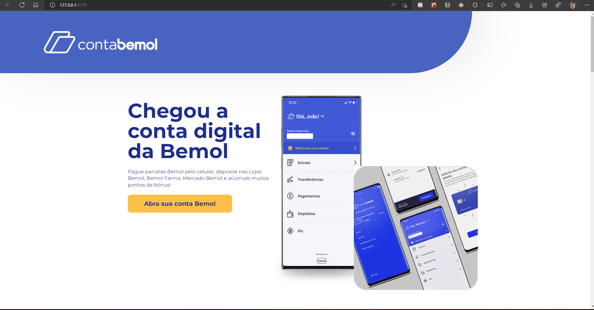

# ThBemol 🏦
## Clone plataforma da famosa Bemol simulando a página para abertura de conta e aquisição de pontos. 

- Deploy: Em breve

### Tecnologias Utilizadas
- React JS
- Typescript
- Html
- CSS
- Vite
- Vercel

### Habilidades Desenvolvidas
- Aplicação com foco em ReactJS e Typescript
- Conceitos básicos usando o React com Typescript

#### Desenvolvido junto com material de aulas da plataforma da Kenzie

